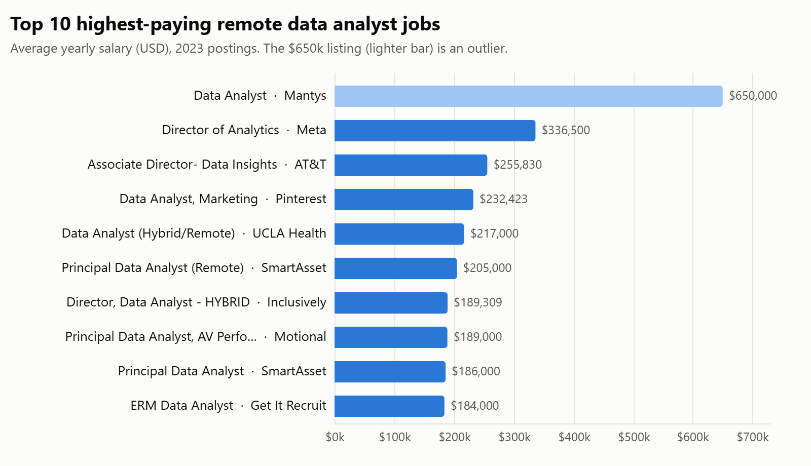
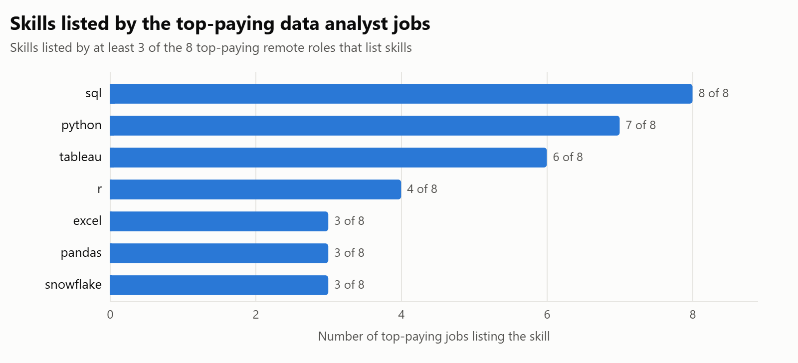
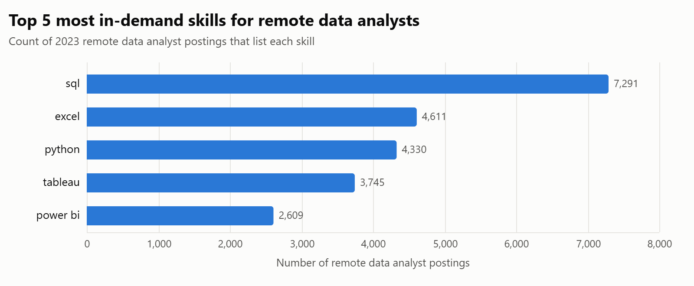
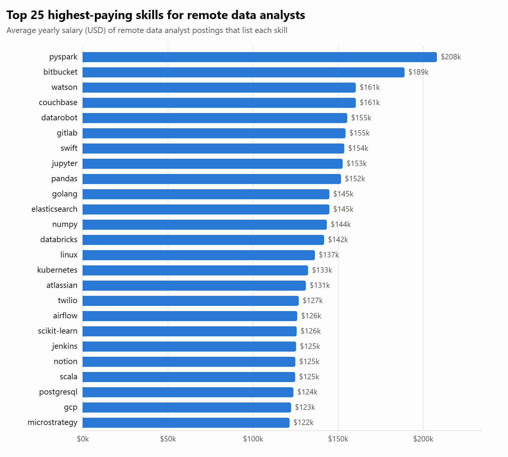
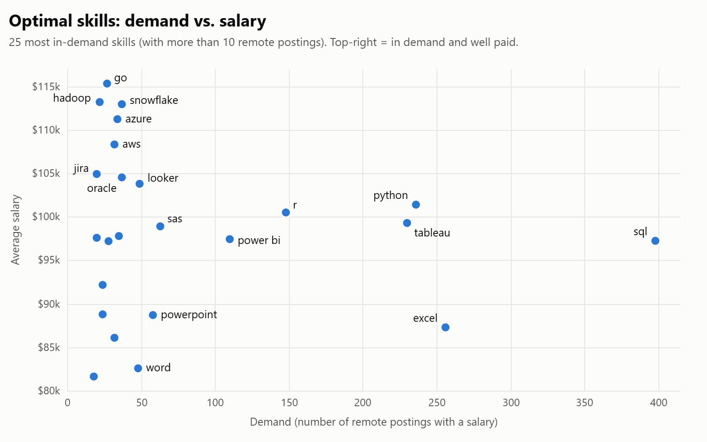
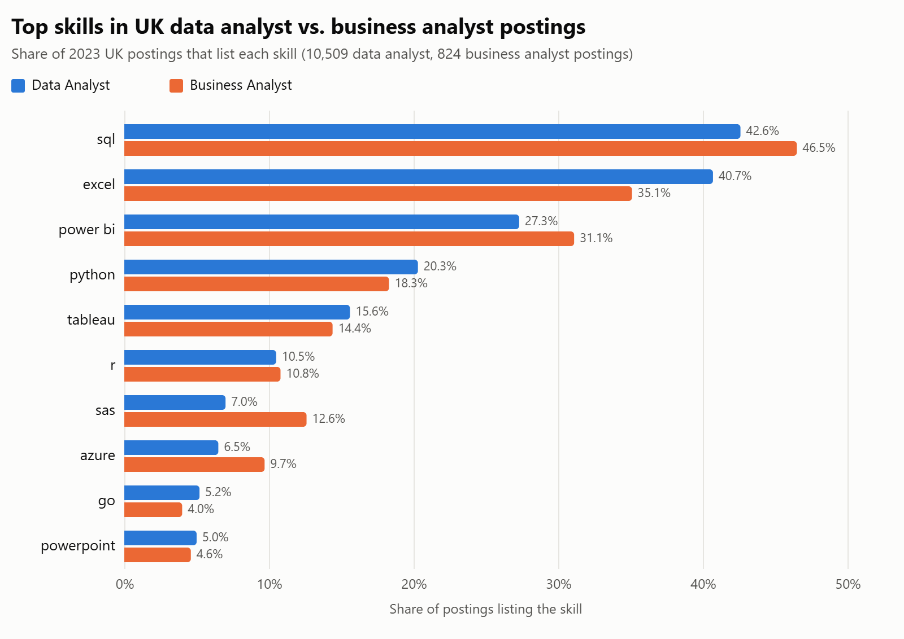

# Data Analyst Job Market Analysis (SQL)

I used SQL to explore the 2023 job market for **remote data analyst roles**. I wanted to know which roles pay best, which skills they ask for, and which skills are both in demand and well paid.

I built it while following Luke Barousse's *SQL for Data Analytics* course, which provided the dataset and the first five questions. I then added a sixth question of my own on the **UK job market**, where I'm looking for work.

## Questions

1. What are the top-paying remote data analyst jobs?
2. What skills do those top-paying jobs require?
3. Which skills are most in demand for data analysts?
4. Which skills are linked to the highest salaries?
5. Which skills are worth learning first because they're both in demand and well paid?
6. **(My extension)** What skills do UK data analyst and business analyst roles ask for?

## Tools

- **PostgreSQL**: database and queries
- **VS Code**: writing and running queries
- **Git & GitHub**: version control

## Data

The data is about 788,000 job postings from 2023, stored in four tables in a star schema:

| Table | Contents |
|---|---|
| `job_postings_fact` | One row per posting: title, location, schedule, salary, remote flag, date |
| `company_dim` | Company names |
| `skills_dim` | Skill names and types |
| `skills_job_dim` | Links each posting to the skills it asks for |

The scripts in [`sql_load/`](sql_load) create the database and tables and load the data.

### How to run it

1. Get the four CSV files from the course materials. They're not stored in this repo because of their size.
2. Run the scripts in `sql_load/` in order, updating the file paths in `3_modify_tables.sql` to where you saved the CSVs.
3. Run any query in `Project_sql/`.

## The analysis

Each query is in [`Project_sql/`](Project_sql), with the question and its purpose written at the top. The charts are in [`assets/`](assets).

### 1. Top-paying jobs ([query](Project_sql/1_top_paying_jobs.sql))
Filters to remote data analyst postings with a stated salary, joins company names, and returns the 10 highest-paying roles.

- The top 10 range from **$184,000 to $650,000** a year.
- The $650k "Data Analyst" listing is a clear outlier. Without it, the top is $336,500 (Director of Analytics at Meta).
- Most of the top roles are senior: director, associate director and principal titles.

### 2. Skills for top-paying jobs ([query](Project_sql/2_top_paying_job_skills.sql))
Uses the logic of query 1 as a CTE and joins it to the skills tables to see what those roles ask for. Two of the ten jobs list no skills, so this covers the other eight.

- **SQL** appears in all 8 roles.
- **Python** appears in 7.
- **Tableau** appears in 6.
- R (4), then Excel, pandas and Snowflake (3 each), follow.

### 3. Most in-demand skills ([query](Project_sql/3_top_demanded_skills.sql))
Counts how often each skill appears across all remote data analyst postings and returns the top 5.

- **SQL** leads by a wide margin, with 7,291 postings.
- **Excel** (4,611) and **Python** (4,330) come next. Spreadsheets are still core to the job.
- **Tableau** (3,745) and **Power BI** (2,609) show that visualisation tools are expected.

### 4. Top-paying skills ([query](Project_sql/4_top_paying_skills.sql))
Averages salary by skill for remote data analyst roles with a stated salary, and returns the top 25.

- **Analysts are moving towards engineering.** PySpark ($208k) tops the list, and Databricks ($142k) and Airflow ($126k) also appear. Employers pay for people who can build data pipelines.
- **Engineering tools pay well.** Bitbucket ($189k), GitLab ($155k), Kubernetes ($132k) and Jenkins ($125k) point to analysts who work like engineers.
- **Python data science tools rank high.** Jupyter, pandas and NumPy all average over $140k, and scikit-learn and GCP show up too.
- Many of these skills appear in only a handful of postings, so their averages come from small samples.

### 5. Optimal skills ([query](Project_sql/5_optimal_skills.sql))
Combines demand counts and average salary (two CTEs joined on skill) for skills with more than 10 remote postings.

- **SQL** is in by far the most demand (398 postings with a salary) and averages about $97k. It's the foundation.
- **Python** ($101k, 236 postings) and **Tableau** ($99k, 230) combine strong demand with above-average pay.
- **Cloud and big-data skills** such as Go ($115k), Snowflake ($113k), Hadoop ($113k), Azure ($111k) and AWS ($108k) pay the most. They appear in fewer postings, which makes them good specialisms.
- **Excel** is in high demand (256) but pays less (about $87k), so it's essential but not a differentiator.

> Note: SAS appears twice in the raw results because it has two skill IDs in `skills_dim`. The chart shows it once.

### 6. UK data analyst vs. business analyst skills ([query](Project_sql/6_uk_analyst_skills.sql))
My own extension. It filters to UK postings for the two roles, counts how many list each skill, and divides by the total for each role, so a 10,509-posting group and an 824-posting group can be compared fairly.

- **SQL** is the top skill for both roles, and appears in more business analyst postings (46.5%) than data analyst ones (42.6%).
- **Excel** (35–41%) and **Power BI** (27–31%) come next. Power BI is more common than Tableau in the UK for both roles, unlike the remote market above.
- **Python** appears in about 1 in 5 postings, so it's useful but not essential for UK analyst roles.
- Business analyst roles ask for **SAS** (12.6%) and **Azure** (9.7%) more often than data analyst roles do.
- Only 77 of these UK postings list a salary, so this question looks at demand, not pay.

## SQL techniques used

- `INNER JOIN` and `LEFT JOIN` across fact and dimension tables
- Common table expressions (`WITH`) to build queries step by step
- Aggregation with `COUNT`, `AVG`, `ROUND` and `GROUP BY`
- Filtering with `WHERE` and `IS NOT NULL`, sorting with `ORDER BY` and `LIMIT`
- `CASE WHEN` inside aggregates to put two roles side by side as columns, with percentages calculated from separate totals

## What I learned

- How to design joins across a star schema to answer a business question
- How to break a complex question into CTEs so each step is easy to check
- How to spot data quality issues (an outlier salary, a duplicated skill ID) before drawing conclusions
- How to turn query results into practical recommendations, such as which skills to prioritise

## Conclusion

For remote data analyst roles:

- **SQL** is the most in-demand skill.
- **SQL, Python and a visualisation tool (Tableau or Power BI)** make up the core toolkit.
- The highest salaries go to analysts who add **cloud and data engineering** skills such as Snowflake, Azure, AWS and PySpark.

In the UK, **SQL, Excel and Power BI** lead for both data and business analyst roles. That matches the skills I'm building for business analyst work.

I'm using this to shape my own development alongside my background in supply chain and procurement.

---

Part of my portfolio: [chiamakaikpo.github.io](https://chiamakaikpo.github.io)
